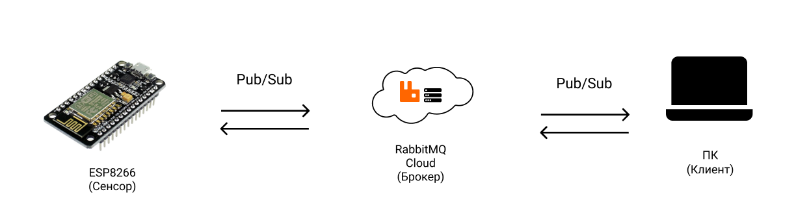
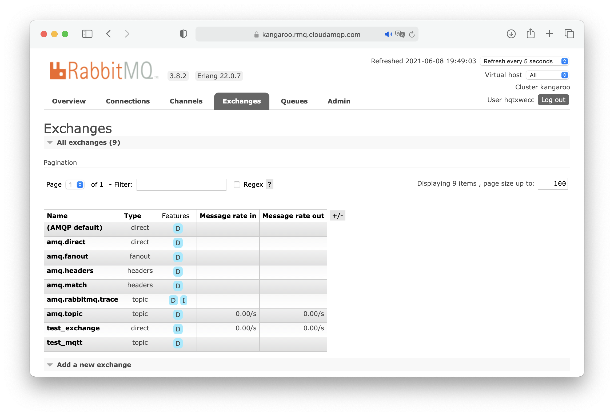
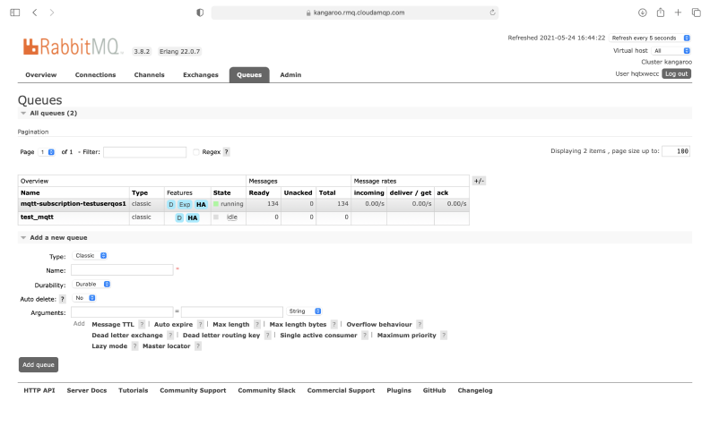
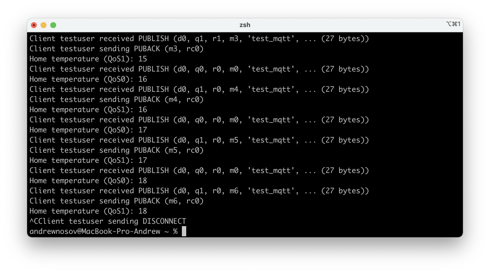

# Система с облачным AMQP-брокером и MQTT-клиентами

Система состоит из AMQP-брокера (реализация RabbitMQ) и подключенных к нему клиентов (MQTT-клиент издатель для устройства с ограниченными ресурсами и MQTT-клиент подписчик на базе ПК).



## Используемое окружение

* облачный сервис;
* роутер Wi-Fi (в случае отсутсвия Wi-Fi модуля в Raspberry Pi);
* микроконтроллер ESP8266 (NodeMCUv2 "Amica");
* персональный компьютер под управлением Mac OS.

Программное обеспечение:
* драйвер [Cilicon Labs CP210xVCPDriver](https://www.silabs.com/developers/usb-to-uart-bridge-vcp-drivers) (обнаружение USBtoUART интерфейса на ПК Mac OS);
* среда разработки [Arduino IDE](https://www.arduino.cc/en/software);
* средства разработки [Xcode](https://apps.apple.com/ru/app/xcode/id497799835?mt=12) (только для Mac OS);
* реализация MQTT-клиента на базе ESP8266 [async-mqtt-client](https://github.com/marvinroger/async-mqtt-client);
* реализация MQTT-клиента [Mosquitto](https://mosquitto.org);
* облачная реализация RabbitMQ-брокера в сервисе [CloudAMQP](https://www.cloudamqp.com).

## Алгоритм сборки, настройки и запуска

#### AMQP-брокер

1. Регистрируемся в сервисе [CloudAMQP](https://www.cloudamqp.com) и создаем AMQP-брокер (реализация RabbitMQ) с бесплатным тарифным планом;
2. Переходим в панель управления брокером "RabbitMQ Manager" (визуальный интерфейс для конфигурации брокера);
3. Во вкладке для управления точками обмена (англ. exchanges) добавляем новую точку обмена "test_mqtt" с типом "topic", в который клиенты будут отсылать данные (см. рисунок ниже);

4. Автоматически (после выполнения этапа 3) создается очередь "mqtt-subscribition-testuserqos1" и привязка к ней (можно создать собственную очередь и настройить привязку к ней для точки обмена "test_mqtt");
5. AMQP-брокер готов к работе (на главной странице брокера в CloudAMQP расположены все данные для подключения).

#### MQTT-клиент издатель на базе NodeMCUv2

1. [Окружение для написания и загрузки программ Arduino IDE](../../demo-tools/arduinoide.md);
2.  Установка клиентской библиотеки библиотеки ([подробная инструкция по установке](https://github.com/marvinroger/async-mqtt-client/blob/master/docs/1.-Getting-started.md#installing-asyncmqttclient))
3. Копируем к себе и открываем в Arduino IDE [файл с кодом](mqttcli_for_amqp.ino), заменяем праметры сети (```WIFI_SSID, WIFI_PASSWORD, MQTT_HOST, CLOUD_LOGIN, CLOUD_PASS, MQTT_PORT```) на собственные, компилируем и загружаем в ESP8266.

#### MQTT-клиент (подписчик) на базе ПК

1. ```brew install mosquitto``` (для Mac OS);
2. ```mosquitto_sub -h <hostname> -d -t <topic> -u <my_vhost:my_username> -P <my_password> -c -i test1 -q 1 -p 1883``` (заменить переменные на данные своего брокера).

#### Сборка и запуск

1. Включаем все устройства, запускаем установленные реализации с корректными параметрами общей локальной сети
2. Система запущена и функционирует

## Демонстрация работоспособности системы

Автоматически созданная очередь для данных из MQTT-издателя



Консольный вывод данных в MQTT-подписчике (получает данные от издателя)



