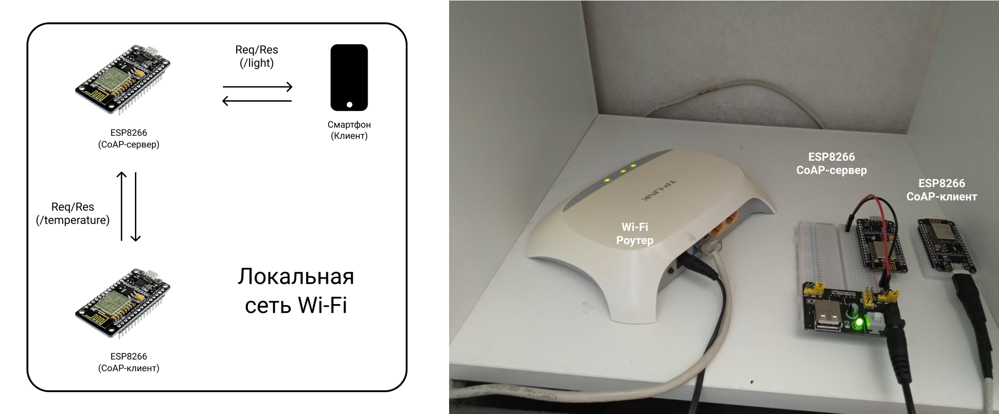
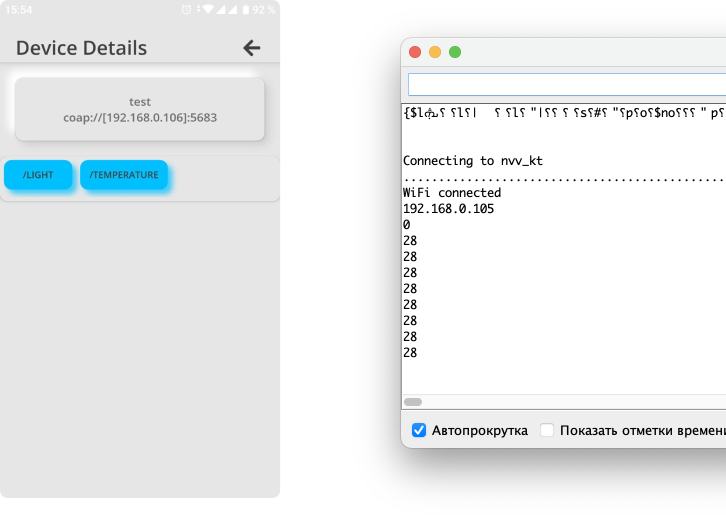

# Локальная система на базе CoAP

Демонстрационная IoT-система состоит из CoAP-сервера, к которому подключен датчик температуры (имитация), а также нескольких получающих данные клиентов на базе ESP8266 и смартфона.



## Используемое окружение

Аппаратное обеспечение:
* роутер Wi-Fi (в случае отсутсвия Wi-Fi модуля в Raspberry Pi);
* 2x микроконтроллер ESP8266 (NodeMCUv2 "Amica");
* Android-смартфон.

Программное обеспечение:
* драйвер [Cilicon Labs CP210xVCPDriver](https://www.silabs.com/developers/usb-to-uart-bridge-vcp-drivers) (обнаружение USBtoUART интерфейса на ПК Mac OS);
* среда разработки [Arduino IDE](https://www.arduino.cc/en/software);
* средства разработки [Xcode](https://apps.apple.com/ru/app/xcode/id497799835?mt=12) (только для Mac OS);
* [реализация](https://github.com/automote/ESP-CoAP) сервера и клиента на базе CoAP;
* [реализация CoAP-клиента](https://play.google.com/store/apps/details?id=com.funworks.CoApp&hl=en_US&gl=US) для Android-устройств.

## Алгоритм сборки, настройки и запуска

Перед началом устанавливаем [окружение для создания и загрузки программ Arduino IDE](../../demo-tools/arduinoide.md)

#### CoAP-сервер

Копируем к себе и открываем в Arduino IDE [файл с кодом клиента](coapserver.ino), заменяем праметры сети (```ssid, pass```) на собственные, компилируем и загружаем в ESP8266.

#### CoAP-клиент (ESP8266)

Копируем к себе и открываем в Arduino IDE [файл с кодом клиента](coapclient.ino), заменяем праметры сети (```ssid, pass```) на собственные, компилируем и загружаем в ESP8266.

#### CoAP-клиент (Mobile)

1. Скачиваем и устанавливаем Android-приложение [CoAP Client](https://play.google.com/store/apps/details?id=com.funworks.CoApp&hl=en_US&gl=US);
2. Подключаемся к CoAP-серверу по локальному IP-адресу.

#### Сборка и запуск

1. Включаем все устройства, запускаем установленные реализации с корректными параметрами общей локальной сети
2. Система запущена и функционирует

## Демонстрация работоспособности системы

Слева изображен экран приложения, справа консольный вывод данных, принимаемых клиентом на базе ESP8266.

