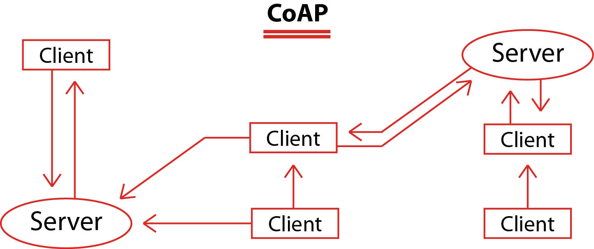

# CoAP (Constrained Applicetion Protocol)

CoAP, можно сказать, является адаптированной под IoT-системы версией HTTP. Принципы и механика работы проткола очень схожи с протоколом HTTP.

[Демо](coap/demo/README.md)

## Основные аспекты протокола

### Модель CoAP-системы представлена на рисунке ниже:

[источник изображения](https://www.pickdata.net/news/mqtt-vs-coap-best-iot-protocol)

Общение клиентов и серверов аналогично HTTP (клиенты отправляют запросы на сервер, сервер отвечает на запросы), на рисунке представлена распределённая система, состоящая из нескольких серверов и клиентов, связанных друг с другом в произвольном порядке, что сложно реализуемо, например, в MQTT.

## Наиболее значимые характеристики протокола

|   Характеристика  |   Значение    |
|----               |----
|   Адаптация к IoT (балл)    |   4/4 |
|   Транспортный Уровень    |   UDP |
|   Кодирование    |    Бинарный    |
|   Заголовок    |    4 байта    |
|   Архитектура    |    Client/Server    |
|   Модель взаимодействия    |    Req/Res    |
|   Участок в сети (наибольшая эффективность)    |    Client2Server, Client2Client    |
|   Надежность    |    Аналоги QoS 0, 1; децентрализация    |
|   Безопасность    |    DTLS-шифрование, аутентификация login/password, сторонние механизмы    |

Основным преимуществом CoAP является легковесность, простота реализации и распределенность системы, а к недостаткам можно отнести молодость (количество реализаций, сообщество пользователей, документирование), сравнительно слабую надежность и защищенность обмена.

## Полезные ссылки:
* [спецификация CoAP](https://datatracker.ietf.org/doc/html/rfc7252);
* [список реализаций](https://en.wikipedia.org/wiki/Constrained_Application_Protocol#Implementations);
* [оф. сайт со стандартами и реализациями](https://coap.technology);
* [Client/Server for Arduino IDE](https://github.com/automote/ESP-CoAP).

[:arrow_left: На главную](/README.md)

