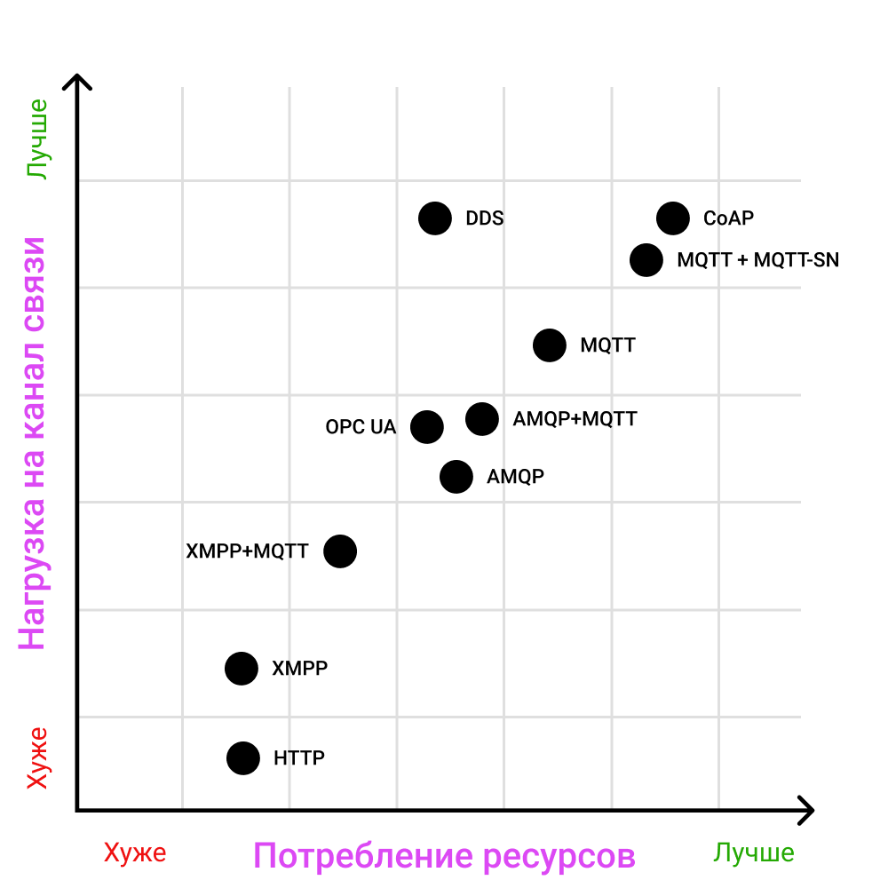
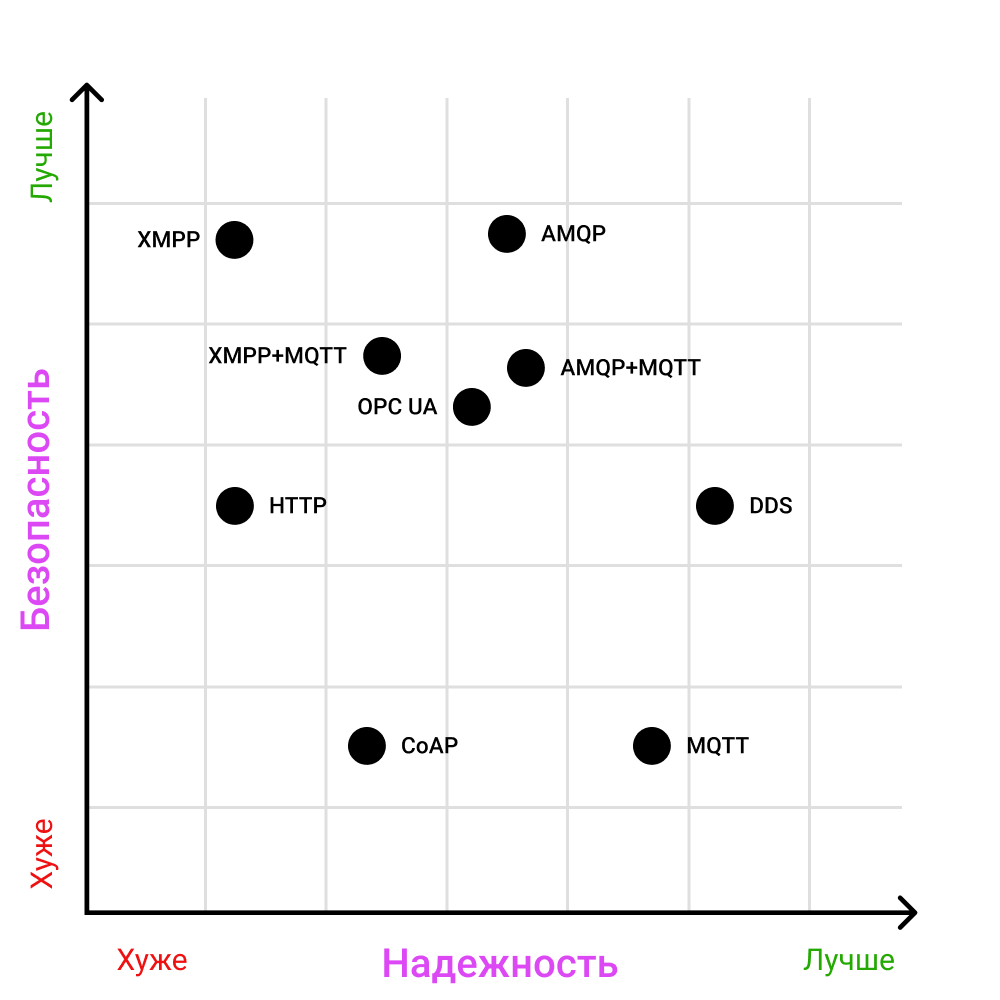
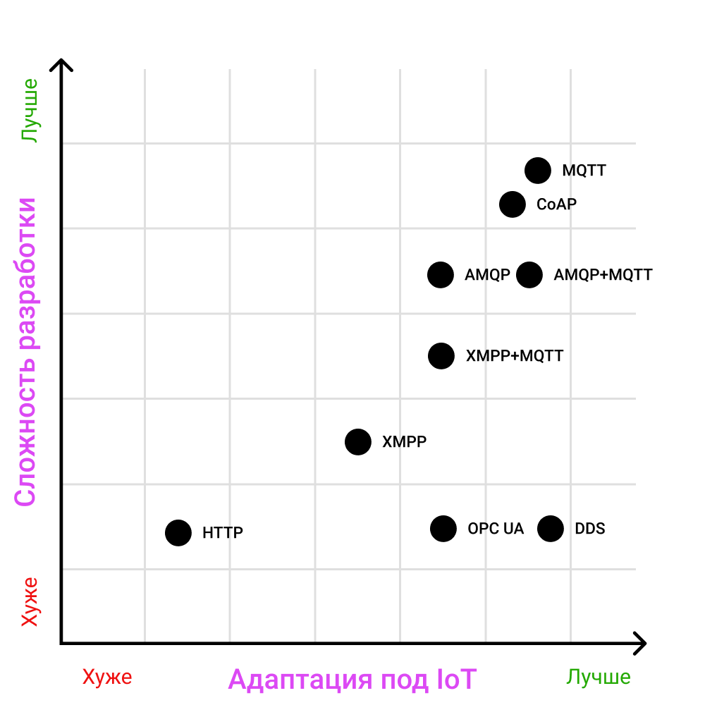
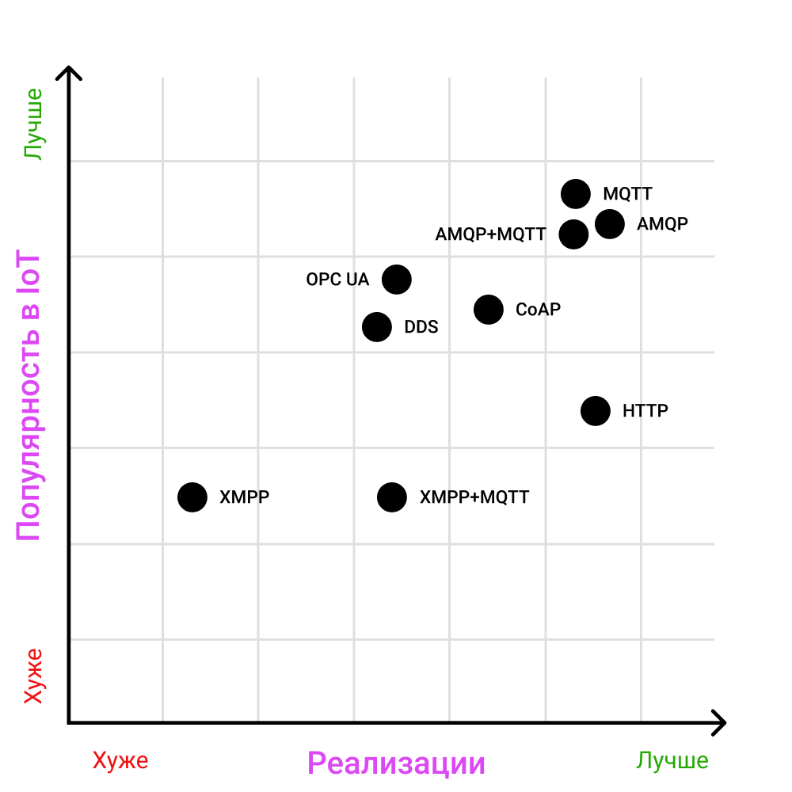
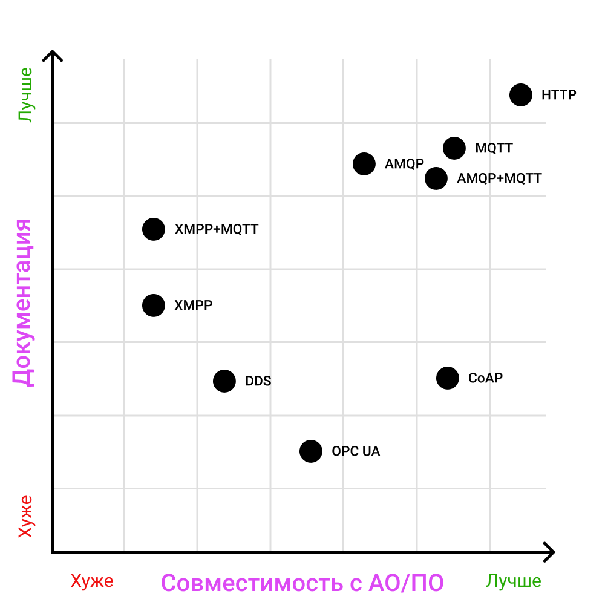
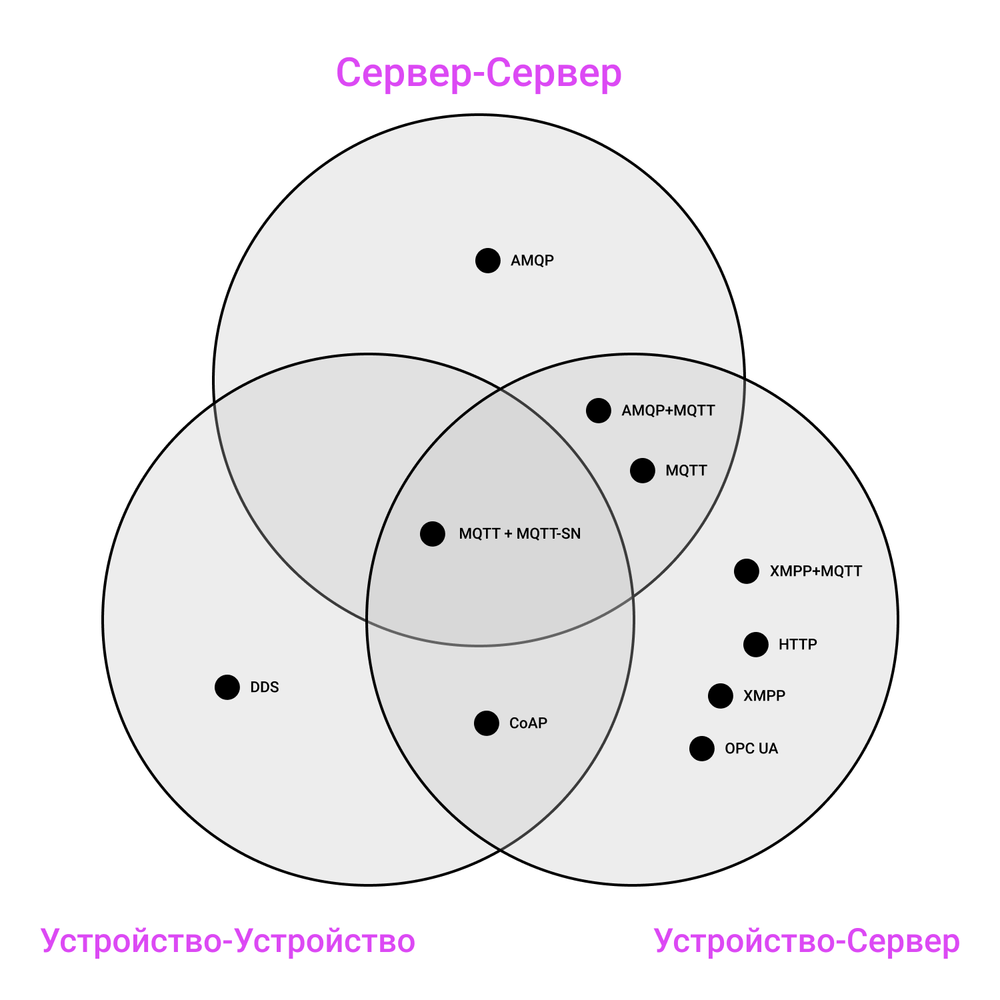

# Сравнение протоклов прикалдного уровня

Данный раздел освещает целевые протоколы прикладного уровня в совокупности, что помогает сформировать общую картино по каждому отдельному решению в сравнении с остальными.

## Обобщенная таблица с характеристиками протоколов

Таблицу можно пролистывать :arrow_right:

|           | Адаптация к IoT | Транспорт | Кодирование             | Заголовок (байт) | Архитектура      | Взаимодействия                                   | Асинхронность | Участок сети | Надежность                  | Безопасность                    |
|-----------|-----------------|-----------|-------------------------|------------------|------------------|--------------------------------------------------|---------------|--------------|-----------------------------|---------------------------------|
| MQTT      | 4/4             | TCP       | Бинарный                | 2-4              | Pub/Sub          | Client/Broker                                    | +             | C2S          | QoS 0, 1, 2                 | TLS/SSL, Login/Password         |
| MQTT-SN   | 4/4             | UDP       | Бинарный                | 2-5              | Pub/Sub          | Client/Gateway -> MQTT-broker (централизованная) | +             | C2C          | QoS -1, 0, 1, 2             | DTLS, MQTT Auth                 |
| AMQP      | 3/4             | TCP       | Бинарный                | 8                | Pub/Sub          | Client/Broker                                    | +             | S2S          | Аналог QoS 0, 1             | TLS/SSL, SASL                   |
| HTTP      | 1/4             | TCP       | Текст (HTTP/2 бинарный) | -                | Req/Res          | Client/Server                                    | -             | C2S          | TCP                         | TLS/SSL, auth Basic/Digest/NTLM |
| CoAP      | 4/4             | UDP       | Бинарный                | 4                | Req/Res          | Client/Server                                    | +             | C2S, C2C     | QoS 0, 1; децентрализация   | DTLS, стороння аутентификация   |
| OPC UA    | 3/4             | TCP       | Бинарный                | 8                | Req/Res          | Client/Server                                    | +             | C2S          | TCP + собственные механизмы | TLS, Login/Password             |
| DDS       | 3.5/4           | UDP, TCP  | Бинарный                | 16               | Pub/Sub, Req/Res | Client/Client                                    | +             | C2C          | 23 QoS                      | TLS/DTLS, своя аутентификация   |
| XMPP      | 2/4             | TCP       | Текст (XML)             | -                | Req/Res          | Client/Server                                    | +             | C2S          | TCP                         | TLS, SASL                       |
| AMQP+MQTT | 4/4             | TCP       | Бинарный                | -                | Pub/Sub          | Client/Broker                                    | +             | C2S, S2S     | QoS 0, 1                    | TLS, SASL?                      |
| XMPP+MQTT | 3/4             | TCP       | Бинарный                | 2-4              | Pub/Sub          | Client/Server                                    | +             | C2S          | QoS 0, 1, 2                 | TLS, SASL?                      |

## Общая таблица с оценкой реализаций

|           | Качество реализаций | Простота разработки | Списки реализаций                                                                                                             |
|-----------|---------------------|---------------------|-------------------------------------------------------------------------------------------------------------------------------|
| MQTT      | 4/4                 | 4/4                 | [Awesome MQTT](https://github.com/hobbyquaker/awesome-mqtt)                                                                   |
| MQTT-SN   | 2/4                 | 3/4                 | [MQTT-SN open source list](https://github.com/topics/mqtt-sn)                                                                 |
| AMQP      | 3/4                 | 4/4                 | [Awesome AMQP](https://github.com/xinchen10/awesome-amqp)                                                                     |
| HTTP      | 4/4                 | 4/4                 | HTTP по умолчанию поддерживается на большинстве платформ; [HTTP/2](https://github.com/httpwg/http2-spec/wiki/Implementations) |
| CoAP      | 3/4                 | 3/4                 | [CoAP List](https://github.com/Agile-IoT/awesome-open-iot#coap)                                                               |
| OPC UA    | 2/4                 | 2/4                 | [OPC UA open source list](https://github.com/open62541/open62541/wiki/List-of-Open-Source-OPC-UA-Implementations)             |
| DDS       | 2/4                 | 1/4                 | [DDS List](https://github.com/nosovandrew/iot-app-layer-guide/blob/main/dds/overview-dds.md#список-реализаций)                |
| XMPP      | 1/4                 | 2/4                 | [XMPP List](https://github.com/nosovandrew/iot-app-layer-guide/blob/main/xmpp/overview-xmpp.md#список-реализаций-xmpp)        |
| AMQP+MQTT | 4/4                 | 4/4                 | [RabbitMQ broker](https://www.rabbitmq.com) + реализации MQTT-клиентов                                                        |
| XMPP+MQTT | 4/4                 | 3/4                 | [Ejabberd server](https://www.ejabberd.im) + реализации MQTT-клиентов                                                         |

## Сравнительный анализ протоколов

### Графики (ранжирование протоколов одновременно по 2 параметрам)

Ранжирование протоколов прикалдного уровня относительно минимального "веса" единицы передаваемых данных и потребления ресурсов оборудования:

Относительно реализации механизмов надежности и безовасности:

Процесс разработки системы (сложность, затраты времени и ресурсов) и ориентация протокола на задачи и специфику IoT-систем:

Популярность протокола среди IoT-систем (сообщество разработчиков, количество успешных проектов) и реализации протокола (разнообразие, функционал, поддержка):

Документирование протокола и совместимость с срзличными программными и аппаратными платформами (на примере окружения, представленного на главной странице руководства):

Размещение протоколов по типовым зонам сети IoT относительно оптимальности использования:

[:arrow_left: На главную](/README.md)