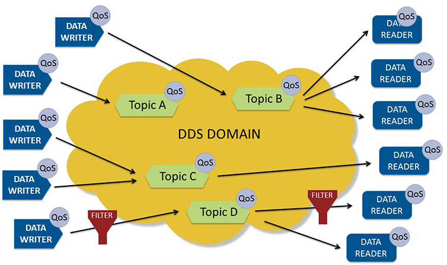

[:arrow_left: На главную](/README.md)

# DDS (Data Distribution Service)

Протокол обмена данными напрямую между клиентами (без промежуточных узлов), используя абстракцию общей шины данных (пространство данных DDS), в которой реализованы темы, позволяющие подписываться и публиковать данные по аналогии с протоколом MQTT. На самом деле, никакой общей шины не существует, а информация о всех темах и содержащихся в них данных хранится на каждом клиенте в виде копии.

[Демо](dds/demo/README.md)

## Основные аспекты протокола

### Модель системы DDS представлена на рисунке ниже:

[источник изображения](https://www.dds-foundation.org/what-is-dds-3/)

Принцип взаимодействия очень схож с работой протокола MQTT (модель Pub/Sub) за исключением того, что местом хранения данных выступает некая абстрактная сущность, а не физический брокер. За счет реализации такого достаточно сложного механизма функционирования, возрастает требование к ресурсам устройств, а также к окружению.

Более подробно изучить протокол можно в [спецификации DDSv1.4.](https://www.omg.org/spec/DDS/1.4/PDF)

## Наиболее значимые характеристики протокола

|   Характеристика  |   Значение    |
|----               |----
|   Адаптация к IoT (балл)    |   3/4 |
|   Транспортный Уровень    |   TCP, UDP |
|   Кодирование    |    Бинарный    |
|   Заголовок    |    16 байт    |
|   Архитектура    |    Client/Client    |
|   Модель взаимодействия    |    Pub/Sub   |
|   Участок в сети (наибольшая эффективность)    |    Client-to-Client,    |
|   Надежность    |    23 класса QoS, децентрализация    |
|   Безопасность    |    DTLS/TLS-шифрование, собственные решения аутентификации    |

**Процесс разработки и запуск системы на базе DDS** является сложным, поскольку, ввиду устройства протокола, тебуется настройка специального окружения для разработки. К тому же реализации протокола являются тяжелыми для понимания и требуют серьезного погружения.

**Документация** по большей степени находится на хорошем уровне, что является немаловажным достоинством, учитывая сложность протокола

## Список реализаций:
* [OpenDDS](https://opendds.org);
* [RTI](https://github.com/rticommunity);
* [eProsima](https://github.com/eProsima):
  * [реализация DDS для устройств с ограниченными ресурсами](https://github.com/eProsima/Micro-XRCE-DDS);
  * [основная реализация Fast-DDS](https://github.com/eProsima/Fast-DDS);
  * [готовый клиент ESP8266](https://github.com/AmarNathH/Micro-XRCE-DDS-Client-ESP8266);
* [The Robot Operating System (ROS) v2](https://docs.ros.org/en/foxy/index.html);
  * [ROS2 Implementation for microcontrollers](https://micro.ros.org);
  * [ROS2 Huge Implementation List](https://github.com/fkromer/awesome-ros2).

[:arrow_left: На главную](/README.md)