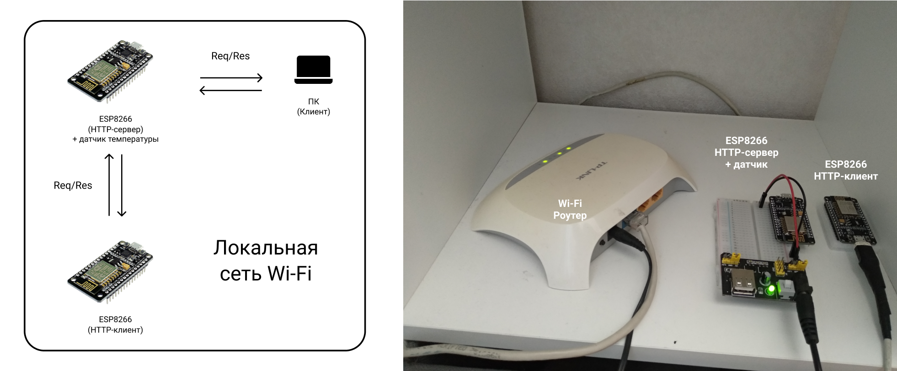
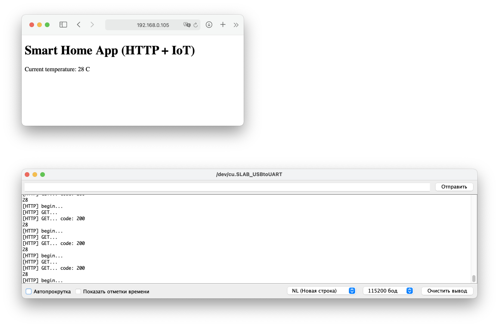

# Локальная система на базе HTTP

Система состоит из HTTP-сервера, к которому подключен датчик температуры (имитация), и HTTP-клиентов (web-клиент и клиент на базе микроконтроллера).



## Используемое окружение

Аппаратное обеспечение:
* роутер Wi-Fi;
* 2x микроконтроллер ESP8266 (NodeMCUv2 "Amica");
* персональный компьютер под управлением Mac OS.

Программное обеспечение:
* драйвер [Cilicon Labs CP210xVCPDriver](https://www.silabs.com/developers/usb-to-uart-bridge-vcp-drivers) (обнаружение USBtoUART интерфейса на ПК Mac OS);
* среда разработки [Arduino IDE](https://www.arduino.cc/en/software);
* средства разработки [Xcode](https://apps.apple.com/ru/app/xcode/id497799835?mt=12) (только для Mac OS);
* встроенные в расширение ESP8266 (для Arduino IDE) реализации HTTP-сервера (ESP8266WebServer) и HTTP-клиента (ESP8266HTTPClient);
* любой web-браузер.

## Алгоритм сборки, настройки и запуска

Перед началом устанавливаем [окружение для создания и загрузки программ Arduino IDE](../../demo-tools/arduinoide.md)

#### HTTP-сервер

Копируем к себе и открываем в Arduino IDE [файл с кодом клиента](http_server.ino), заменяем праметры сети (```STASSID, STAPSK```) на собственные, компилируем и загружаем в ESP8266.

#### HTTP-клиент (ESP8266)

Копируем к себе и открываем в Arduino IDE [файл с кодом клиента](http_client.ino), заменяем праметры сети на собственные, компилируем и загружаем в ESP8266.

#### HTTP-клиент (Web)

Открываем браузер и подключаемся к HTTP-серверу по лакльному IP-адресу, сервер вернет минмальный web-интерфейс с данными о температуре.

#### Сборка и запуск

1. Включаем все устройства, запускаем установленные реализации с корректными параметрами общей локальной сети
2. Система запущена и функционирует

## Демонстрация работоспособности системы

Верхнее окно демонстрирует браузерный клиент, нижнее — прием данных клиентом на базе ESP8266.

