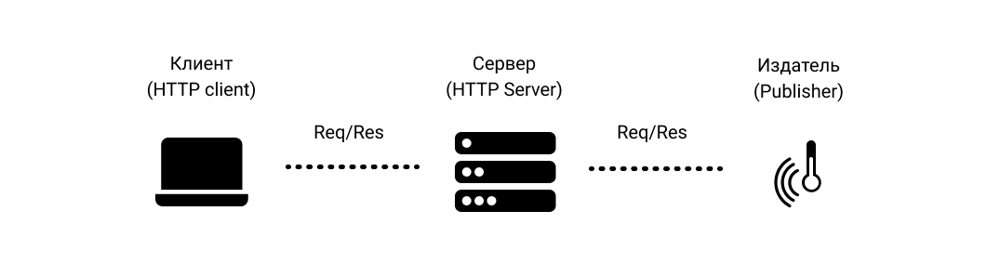

[:arrow_left: На главную](/README.md)

# HTTP (HyperText Transport Protocol)

Протокол особо не нуждается в представлении, изначально разработан для передачи гипертекстовых документов, однако в последующем стал применяться для передачи любых данных. HTTP харакеризуется глобальным распространением (за счет использования в web-технологиях по умолчанию) и имеет реализации для большей части аппаратного и программного обеспечения.

На заре технологии IoT протокол HTTP актвно применялся на прикладном уровне (ввиду отсутствия альтернатив), что поспособствовало его широком распростронению на рынке IoT-технологий, хотя для целей и задач IoT-систем он слабо адаптирован. У протокола есть версия 2.0, которая немного лучше справляется с устройствами в сети с ограниченными ресурсами.

## Основные аспекты протокола

Структура сети изображена на рисунке:

Принцип работы достаточно прост, клиенты могут отправлть и принимать данные, которые располагаются на сервере. Данная моедль широко используется в web-среде (всевозможные сайты и приложения отрисовывают сраницы с помощью HTTP), однако в случае c IoT передаются данные.

## Наиболее значимые характеристики протокола

|   Характеристика  |   Значение    |
|----               |----
|   Адаптация к IoT (балл)    |   1/4 |
|   Транспортный Уровень    |   TCP |
|   Кодирование    |    Текстовый (HTTPv2 бинарный)    |
|   Заголовок    |    -    |
|   Архитектура    |    Client/Server    |
|   Модель взаимодействия    |    Req/Res    |
|   Участок в сети (наибольшая эффективность)    |    Client-to-Server    |
|   Надежность    |    Ограничен TCP  |
|   Безопасность    |    TLS/SSL-шифрование, механизмы аутентификации Basic/Digest/NTLM   |

Можно выделить огромную популярность протокола (как следствие: сообщество разработчиков, реализации практически для любой платформы, хорошая документация), а также простоту процесса разработки систем, однако протокол слабо подходит под требования IoT-систем, даже с учетом HTTPv2.

Протокол HTTP по умолчанию поддерживается для большинства платформ, а реализации HTTPv2 можно найти в [ресурсе](https://github.com/httpwg/http2-spec/wiki/Implementations) (представлен список клиентов, серверов и доп. инструментов).

[:arrow_left: На главную](/README.md)