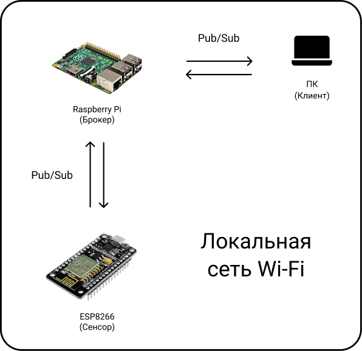
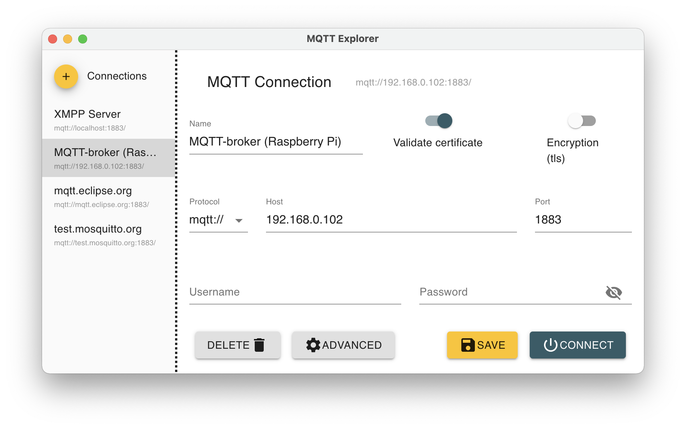
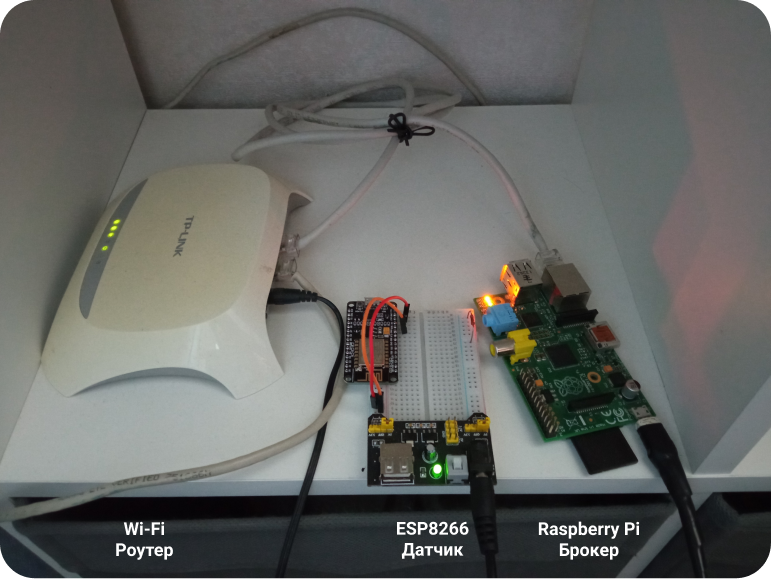
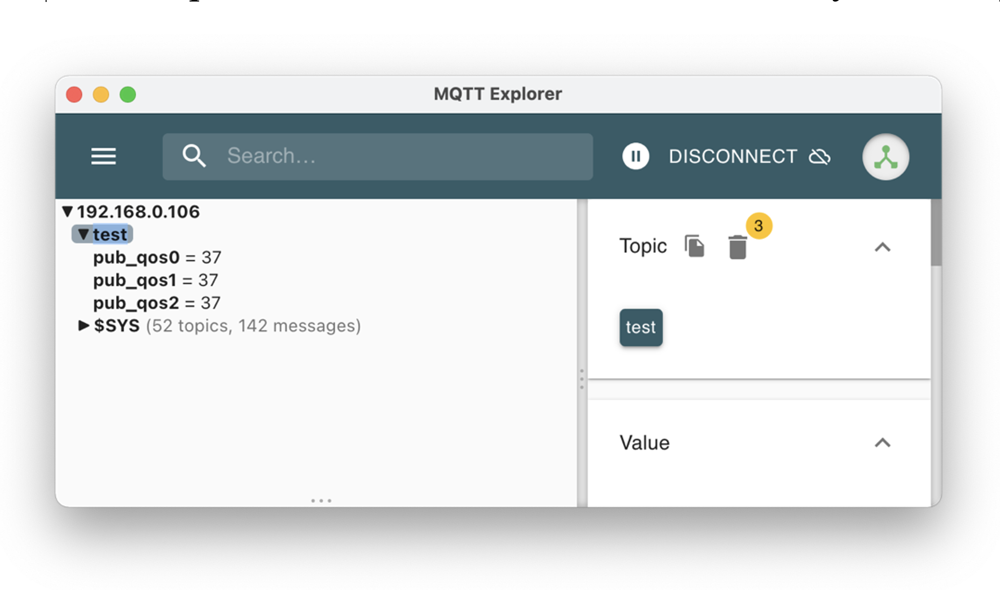

# Локальная MQTT-система

Структура реализуемой IoT-системы, состоящей из центрального узла (MQTT-брокер) и нескольких клиентов (MQTT-издатель и MQTT-подписчик), которые общаются между собой.



## Используемое окружение

Аппаратное обеспечение:
* одноплатный ПК Raspberry Pi 1 Model B (допускается использование более новых версий Raspberry Pi <2/3/4> Model <A/B/A+/B+>) + внешний носитель (SD-карта);
* роутер Wi-Fi (в случае отсутсвия Wi-Fi модуля в Raspberry Pi);
* микроконтроллер ESP8266 (NodeMCUv2 "Amica");
* персональный компьютер под управлением Mac OS.

Программное обеспечение:
* драйвер [Cilicon Labs CP210xVCPDriver](https://www.silabs.com/developers/usb-to-uart-bridge-vcp-drivers) (обнаружение USBtoUART интерфейса на ПК Mac OS);
* среда разработки [Arduino IDE](https://www.arduino.cc/en/software);
* реализация MQTT-брокера [Mosquitto](https://mosquitto.org/download/);
* реализация MQTT-клиента на базе ESP8266 [async-mqtt-client](https://github.com/marvinroger/async-mqtt-client);
* реализация кроссплатформенного MQTT-клиента на базе ПК [MQTT Explorer](http://mqtt-explorer.com);
* средства разработки [Xcode](https://apps.apple.com/ru/app/xcode/id497799835?mt=12) (только для Mac OS).

## Алгоритм сборки, настройки и запуска

#### MQTT-брокер на базе Raspberry Pi с помощью Mosquitto

1. Подключение к Raspberry Pi удаленно по SSH (через Wi-Fi или Ethernet), либо прямое управление с помощью периферии (экран, клавиатура, компьютерная мышь);
2. [Установка Raspberry Pi OS](https://www.raspberrypi.org/documentation/installation/installing-images/) на одноплатный ПК:
   1. ```sudo apt install rpi-imager```
   2. запуск Raspberry Pi Imager
3. [Установка брокера Mosquitto](https://mosquitto.org/blog/2013/01/mosquitto-debian-repository/):
   * ```apt-get install mosquitto```
4. Конфигурация и запуск MQTT-брокера:
   1. ```sudo nano /etc/mosquitto/mosquitto.conf``` используется для настройки брокера, если это необходимо
   2. ```sudo /etc/init.d/mosquitto <start/stop>``` используется для запуска, либо остановки сервера

#### MQTT-клиент (издатель) на базе NodeMCUv2

1. Скачиваем (см. пункт "Используемое окружение") и устанавливаем драйвер для USBtoUART-интерфейса, затем перезагружаем ПК;
2. Установка и подготовка среды разработки Arduino IDE для работы с NodeMCU:
   1. Скачиваем и устанавливаем Arduino IDE
   2. Проходим путь ```File > Preferences > Additional Boards Manager```  и в поле ссылок вствляем ```http://arduino.esp8266.com/stable/package_esp8266com_index.json```
   3. Проходим ```Tools > Board menu``` и выбираем нужную версию аппаратного обеспечения ```ESP8266 Boards > Generic ESP8266 Module```
3. Установка клиентской библиотеки библиотеки ([подробная инструкция по установке](https://github.com/marvinroger/async-mqtt-client/blob/master/docs/1.-Getting-started.md#installing-asyncmqttclient))
4. Копируем к себе и открываем в Arduino IDE [файл с кодом](mqtt_cli_qos012_esp8266.ino), заменяем праметры сети (```WIFI_SSID, WIFI_PASSWORD, MQTT_HOST```) на собственные, компилируем и загружаем в ESP8266

#### MQTT-клиент (подписчик) на базе ПК

1. Скачиваем (см. пункт "Используемое окружение") и устанавливаем реализацию MQTT-клиента на ПК;
2. Запускаем клиент, в окне подключения ввобдим необходимые параметры подключкения к брокеру.



#### Сборка и запуск

1. Включаем все устройства, запускаем установленные реализации с корректными параметрами общей локальной сети
2. Система запущена и функционирует

## Демонстрация работоспособности системы

Изображение работающей системы в сборе (на фото отсутсвует ПК с установленным MQTT-клиентом)



MQTT-клиент (подписчик) получает данные от издателя и отбражает их в панели управления

