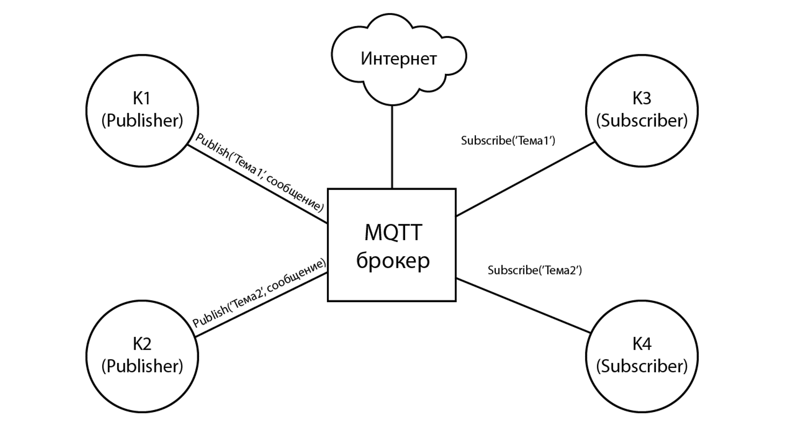
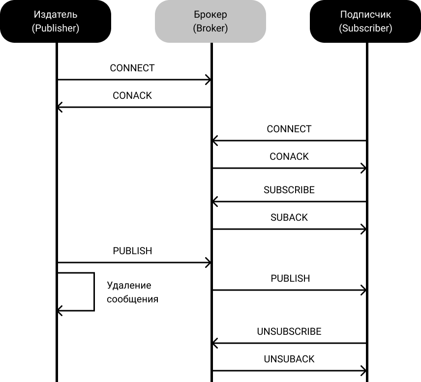
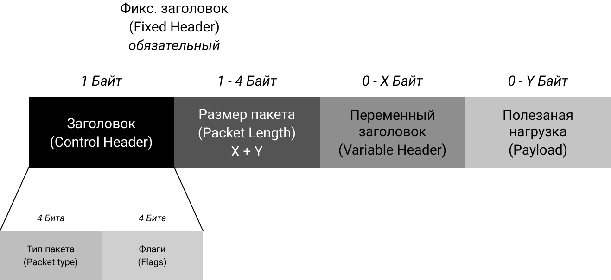

# MQTT (Message Queuing Telemetry Transport)

Протокол обмена данными внутри сети, состоящей из клиентов 2 видов (издателей и подписчиков), а также бцентрального брокера, который осущетсвляет хранение и маршрутизацию передаваемых данных.

## Основные аспекты протокола

### Модель MQTT-системы представлена на рисунке ниже:

Принцип работы достаточно прост, MQTT-брокер является центром системы, соединяющим все остальные узлы. Клиенты-издатели (англ. publishers), в качестве которых зачастую выступают различные датчики, отсылают данные в определенную тему (англ. topic), расположенную внутри MQTT-брокера. Клиент-подписчик (англ. subscriber) может “подписаться” на различные темы внутри MQTT-брокера и получать данные, а также отправлять управляющие команды другим устройствам.

Сильнейшая сторона протокола — это его легкость и простота, протокол по-настоящему минималистичен и нацелен на единственную задачу (обмен данными), в связи с этим возможностей конфиграции крайне мало.

### Процесс обмена данными (QoS 0) представлен на рисунке:

Обмен происходит при помощи специально определенных типов сообщений (всего 15 видов), каждый тип выполняет опредленную функцию и отвечает за специфичную модель поведения системы. 

### Общая структура MQTT-сообщения представлена на рисунке ниже:

Фиксированный заголовок является обязательной частью каждого MQTT-сообщения, он состоит из 2-х полей (контрольный заголовок и размер пакета). Контрольный заголовок имеет длину 1 байт и содержит информацию о типе сообщения (CONNECT, PUBLISH и т.д.), а также 4 бита информации о флагах в сообщении:

* DUP — повторная отправка сообщения;
* QoS (0, 1, 2) — качество обслуживания;
* Retain — при публикации сообщения с этим флагом, брокер сохранит его.

Поле “Размер пакета” может занимать от 1 до 4 байт, и содержит информацию о битовой длине конкретного сообщения.

Минимальный размер сообщения составляет 2 байта (1 байт для контрольного заголовка, 1 байт для битовой длины сообщения), таким сообщением может являться DISCONNECT. Максимальная же длина пакета составляет 256 мегабайт.

Переменный заголовок содержится не во всех типах сообщений, а его содержание зависит от конкретного сообщения, в котором он используется на данный момент. В переменном заголовке могут помещаться следующие данные:

* Packet Identifier — идентификатор пакета;
* Protocol Name — имя протокола;
* Protocol Version — версия протокола;
* Topic name — название темы;
* прочая информация.
  
Полезная нагрузка (данные, передаваемые в сообщении) является последней частью MQTT-сообщения, ее содержимое определяется в приложении. Сообщения CONNECT, SUBSCRIBE, SUBACK, UNSUBSCRIBE, UNSUBACK обязательно имеют поле нагрузки, PUBLISH-сообщения могут содержать, либо не содержать данное поле, остальные типы сообщений не располагают данным полем.

Более подробно все механизмы работы протокола MQTT можно изучить в следующих источниках:
* [Спецификация MQTTv5 (самая свежая версия протокола)](https://docs.oasis-open.org/mqtt/mqtt/v5.0/mqtt-v5.0.html);
* [Спецификация MQTTv3.1.1 (достаточно актуальная версия)](http://docs.oasis-open.org/mqtt/mqtt/v3.1.1/os/mqtt-v3.1.1-os.html);
* [Емкое описание работы MQTT-системы](https://randomnerdtutorials.com/what-is-mqtt-and-how-it-works/).

## Наиболее значимые характеристики протокола

|   Характеристика  |   Значение    |
|----               |----
|   Адаптация к IoT (балл)    |   4/4 |
|   Транспортный Уровень    |   TCP |
|   Кодирование    |    Бинарный    |
|   Заголовок    |    2-4 байт    |
|   Архитектура    |    Client/Broker (централизованная)    |
|   Модель взаимодействия    |    Pub/Sub    |
|   Участок в сети (наибольшая эффективность)    |    Client-to-Server    |
|   Надежность    |    QoS 0, 1, 2    |
|   Безопасность    |    TLS/SSL-шифрование, простейшая аутентификация login/password    |

Исчерпывающий **список реализаций** брокера, клиентов, дополниткльных инструментов представлен в ресурсе [Awesome MQTT](https://github.com/hobbyquaker/awesome-mqtt).

**Процесс разработка и запуска системы на базе MQTT** очень простой и не отнимает много времени, это связано с минималистичностью протокола (нет необходимости в сложных настройках каждого из элементов MQTT-системы), а также с его широкой распространенностью, следствием чего явялется разнообразие реализаций и спредств разработки.

Большинство реализаций обладают хорошо проработанной **документацией**, а также широким сообществом разработчиков, что, безусловно, упрощает все процессы по проектированию, реализации и эксплуатации.

[:arrow_left: На главную](/README.md)