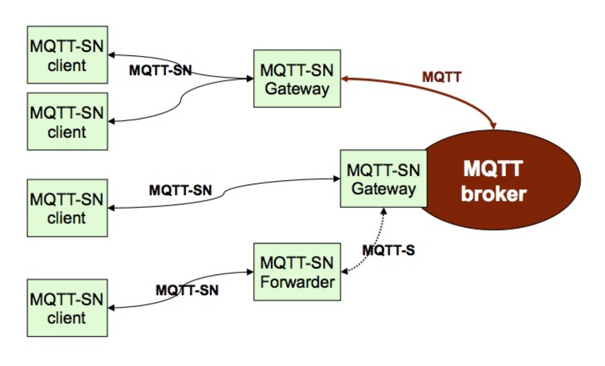
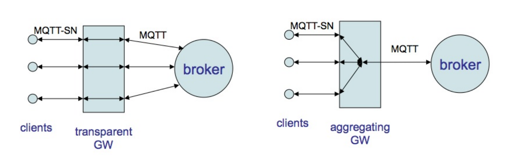

# MQTT-SN (Message Queuing Telemetry Transport Sensor Network)

MQTT-SN является дополнением к основной версии протокола и предназначена для работы с сенсорными узлам (устройства с ограниченными ресурсами) в MQTT-сети. Протокол не является самодостаточным и нуждается в наличии классического MQTT-брокера.

## Основные аспекты протокола

### Модель системы MQTT-SN представлена на рисунке ниже:

[источник изображения](https://www.oasis-open.org/committees/download.php/66091/MQTT-SN_spec_v1.2.pdf)

Наличие MQTT брокера на схеме, помимо клиентов (англ. clients), шлюзов (англ. gateway) и форвардера (англ. forwarder) MQTT-SN, означает, что для функционирования протокола MQTT-SN полноценный MQTT брокер обязателен и необходим. 

Если рассмотреть функции каждого участника обмена то получается следующее:
* MQTT-SN клиенты (как принимающие так и передающие сообщения) подключаются к MQTT брокеру, через MQTT-SN шлюзы;
* MQTT-SN шлюз, основная функция которого — двусторонняя трансляция между MQTT-SN и MQTT;
* MQTT-SN форвардер - если клиентам недоступен шлюз, они могут посылать и принимать сообщения через него прямо в MQTT-брокер;
* MQTT брокер — сервер, своеобразное ядро системы, который пересылает сообщения.

MQTT-SN шлюзы делятся на 2 типа, относительно соединения клиентов с MQTT-брокером (см. рисунок ниже):
* "прозрачное" соединение — шлюз устанавливает и поддерживает отдельное соединение с MQTT брокером;
* агрегированное соединение — шлюз будет иметь только одно соединение с MQTT брокером, а сообщения остаются между клиентами и шлюзом.

Более подробно все механизмы работы протокола MQTT-SN можно получить в следующих источниках:
* [Спецификация MQTTv1.2 (сжато и локанично описаны все основные аспекты)](https://www.oasis-open.org/committees/download.php/66091/MQTT-SN_spec_v1.2.pdf);
* [Сжатое описание основных аспектов](http://www.steves-internet-guide.com/mqtt-sn/).

## Наиболее значимые характеристики протокола

|   Характеристика  |   Значение    |
|----               |----
|   Самостоятельность    |   Необходимо наличие MQTT-брокера |
|   Адаптация к IoT (балл)    |   4/4 |
|   Транспортный Уровень    |   UDP |
|   Кодирование    |    Бинарный    |
|   Заголовок    |    2-5 байт    |
|   Архитектура    |    Client/Gateway -> MQTT-broker (централизованная)    |
|   Модель взаимодействия    |    Pub/Sub    |
|   Участок в сети (наибольшая эффективность)    |    Client-to-Client    |
|   Надежность    |    QoS -1, 0, 1, 2 (QoS -1 не трубует установления соединения)  |
|   Безопасность    |    DTLS-шифрование, простейшая аутентификация login/password на стороне брокера   |

MQTT-SN имеет сравнительно небольшое количество реализаций:
* [работа с MQTT-SN и ESP8266 (приведено несколько реализаций MQTT-SN)](https://habr.com/ru/post/550902/);
* [одна из самых популярных готовых реализаций для Arduino IDE](https://github.com/S3ler/arduino-mqtt-sn-client).

[:arrow_left: На главную](/README.md)