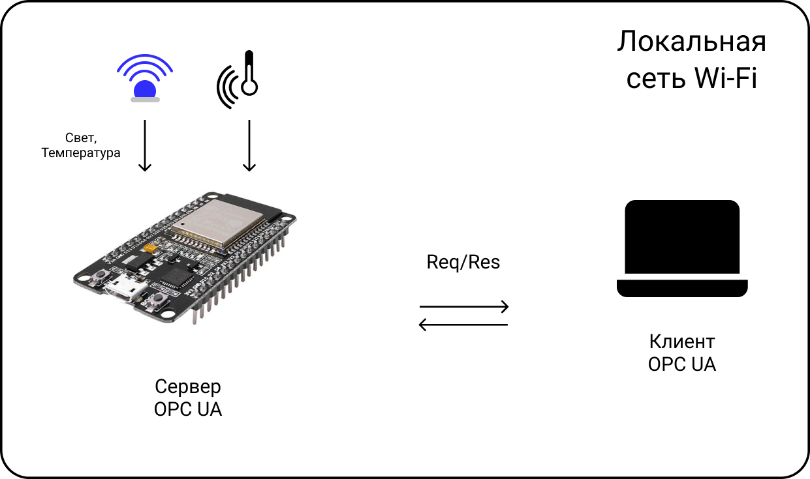
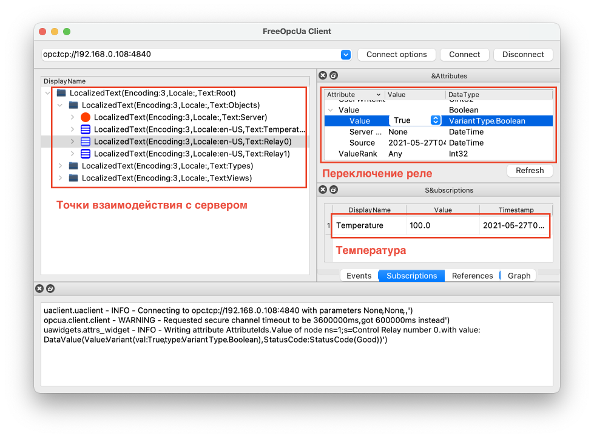

## Локальная система на базе протоокла OPC UA

Демонстрационная система состоит из сервера и клиента (сервер имитирует подключение датчика температуры, а также нескольких реле), клиент построен на базе ПК и имеет графический интерфейс.



## Используемое окружение

Аппаратное обеспечение:
* роутер Wi-Fi;
* микроконтроллер ESP32;
* персональный компьютер под управлением Mac OS.

Программное обеспечение:
* драйвер [Cilicon Labs CP210xVCPDriver](https://www.silabs.com/developers/usb-to-uart-bridge-vcp-drivers) (обнаружение USBtoUART интерфейса на ПК Mac OS);
* средства разработки [Xcode](https://apps.apple.com/ru/app/xcode/id497799835?mt=12) (только для Mac OS);
* среда разработки [ESP-IDF](https://github.com/espressif/esp-idf) для работы с микроконтроллерами ESP32;
* [клиентаская реализация OPC UA](https://github.com/FreeOpcUa/opcua-client-gui) для ПК.

## Алгоритм сборки, настройки и запуска

#### Установка среды разработки ESP-IDF (оф. инструмент для работы с ESP32) на Mac OS/Linux

1. Скачиваем и устанавливаем драйвер для USBtoUART-интерфейса [Cilicon Labs CP210xVCPDriver](https://www.silabs.com/developers/usb-to-uart-bridge-vcp-drivers);
2. Клонируем файлы среды разработки: ```git clone https://github.com/espressif/esp-idf.git```;
3. Переходим в склонированную директорию ```cd ~/esp/esp-idf``` и запускаем ```./install.sh```;
4. Настраиваем переменные среды: ```source export.sh```;
5. Все готово к работе, можно собирать и загружать проекты в папку ```/examples``` и загружать их в ESP32 при помощи команд: ```idf.py build && idf.py flash```.

#### Сервер OPC UA на базе ESP32

1. Колонируем папку с реализацией сервера OPC UA в директоруию ```<your-source>/esp-idf/examples```: ```git clone https://github.com/nosovandrew/opcua-esp32.git```;
2. Переходим в склонированный проект и меняем сетевые настройки;
3. Запускаем компиляцию, затем загрузку в микроконтроллер: ```idf.py build && idf.py flash```.

#### Клиент OPC UA на базе ПК

1. Устанавливаем python: ```brew install python3 ```;
2. Устанавливаем клиент: ```pip3 install opcua-client```;
3. Запускаем клиент ```opcua-client``` и подключаемся к серверу по IP-адресу.

#### Сборка и запуск

1. Включаем все устройства, запускаем установленные реализации с корректными параметрами общей локальной сети
2. Система запущена и функционирует

## Демонстрация работоспособности системы

Окно клиента с информацией о температуре и интерфейсом для управления реле:

