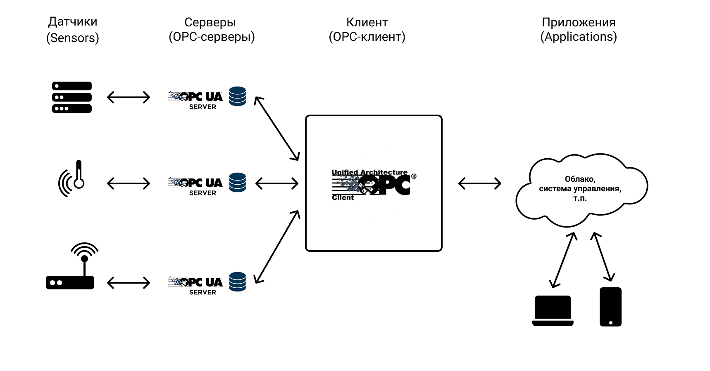
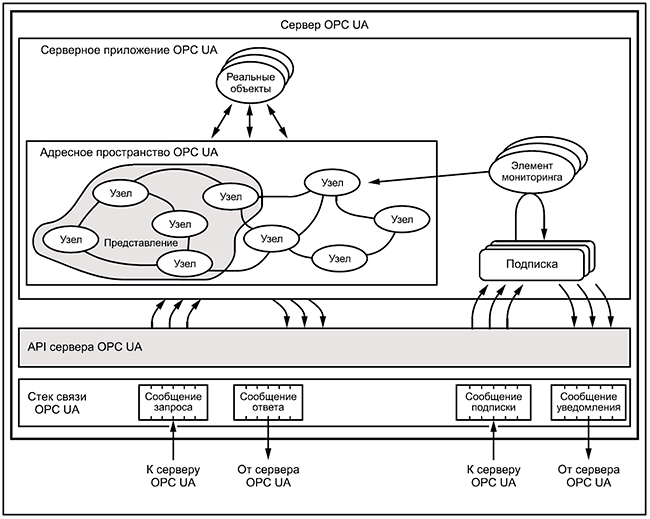
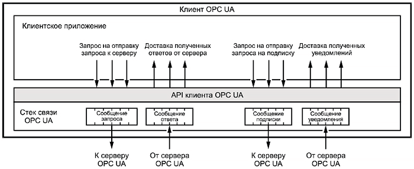

# OPC UA (Open Platform Communication United Architecture)

Это стандарт, описывающий передачу данных в промышленных сетях. Он обеспечивает защищенную и надежную коммуникацию между устройствами, являясь при этом аппаратно- и платформо-независимым, что позволяет обеспечить обмен данными между устройствами с разными операционными системами.

[Демо](opcua/demo/README.md)

## Основные аспекты протокола

### Модель системы OPC UA представлена на рисунке ниже:

IoT-система под управлением OPC UA состоит из набороа серверов и клиентов, серверы взаимодействуют с конечными устройствами (сенсоры, актуаторы и прочие устройства, как правило имеющие ограничение по ресурсам), клиенты позволяют взаимодйествовать с серверами (получать-отправлять данные, осуществлять мониторинг и собирать статистику). Клиенты и сервер могут использовать 2 моедли взаимодействия: Pub/Sub, Req/Res.

### Схематичное устройство сервера OPC UA:

[источник изображения](https://ipc2u.ru/articles/prostye-resheniya/prosto-o-standartakh-opc-da-i-opc-ua/)

### Схематичное устройство клиента OPC UA:

[источник изображения](https://ipc2u.ru/articles/prostye-resheniya/prosto-o-standartakh-opc-da-i-opc-ua/)

## Наиболее значимые характеристики протокола

|   Характеристика  |   Значение    |
|----               |----
|   Адаптация к IoT (балл)    |   3/4 |
|   Транспортный Уровень    |   TCP |
|   Кодирование    |    Бинарный (также текстовый, в виде XML)    |
|   Заголовок    |    8 байт    |
|   Архитектура    |    Client/Server    |
|   Модель взаимодействия    |    Pub/Sub, Req/Res    |
|   Участок в сети (наибольшая эффективность)    |    Client-to-Server,    |
|   Надежность    |    TCP, собственные механизмы    |
|   Безопасность    |    TLS/SSL-шифрование, аутентификация login/password    |

**Процесс разработка и запуска системы на базе OPC UA** достаточно сложен, поскольку устройство протокола достатчно сложное, а возможностей конфигурации очень много. Также можно отметить не всегда хорошее качества реализаций и документации к ним.

Полезные ссылки:
* [спецификация OPC UA](https://opcfoundation.org/developer-tools/specifications-unified-architecture);
* [список реализаций протокола](https://github.com/open62541/open62541/wiki/List-of-Open-Source-OPC-UA-Implementations);
* [Client/Server for Arduino IDE](https://github.com/automote/ESP-CoAP).

[:arrow_left: На главную](/README.md)

