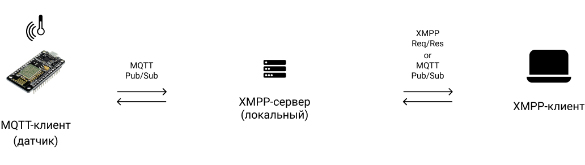
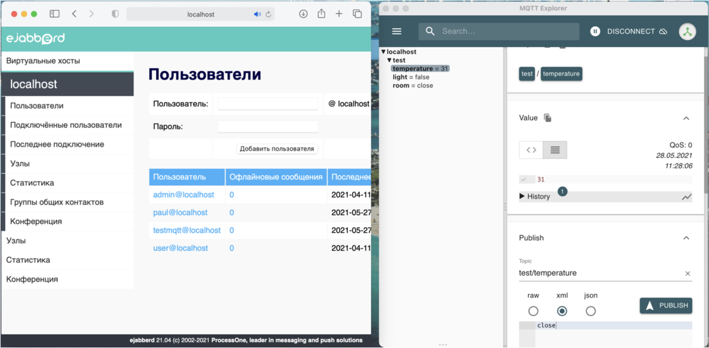

# Демонстрационная система под управлением XMPP

Система состоит из локального XMPP-брокера (Ejabberd) на базе ПК и MQTT-клиентов (Mosquitto).



## Используемое окружение

Аппаратное обеспечение:
* роутер Wi-Fi;
* микроконтроллер ESP8266 (NodeMCUv2 "Amica");
* персональный компьютер под управлением Mac OS.

Программное обеспечение:
* драйвер [Cilicon Labs CP210xVCPDriver](https://www.silabs.com/developers/usb-to-uart-bridge-vcp-drivers) (обнаружение USBtoUART интерфейса на ПК Mac OS);
* среда разработки [Arduino IDE](https://www.arduino.cc/en/software);
* реализация MQTT-клиента на базе ESP8266 [async-mqtt-client](https://github.com/marvinroger/async-mqtt-client);
* реализация кроссплатформенного MQTT-клиента на базе ПК [MQTT Explorer](http://mqtt-explorer.com);
* средства разработки [Xcode](https://apps.apple.com/ru/app/xcode/id497799835?mt=12) (только для Mac OS).

## Алгоритм сборки, настройки и запуска

Перед началом устанавливаем [окружение для создания и загрузки программ Arduino IDE](../../demo-tools/arduinoide.md)

#### XMPP-сервер (Mac OS и Ejabberd)

1. ```brew install ejabberd``` (для Mac OS);
2. Настраиваем конфигурацию сервера на работу с MQTT-клиентами путем добавления в конфигурационный файл (```/usr/local/etc/ejabberd/ejabberd.yml```) следующей записи:

```
listen:
  -
    port: 1883
    module: mod_mqtt
    backlog: 1000
  -
    port: 8883
    module: mod_mqtt
    backlog: 1000
    tls: true

# adapt the path to your own certfile (only for 8883 port)  
certfiles:
  - "../../conf/mqtt.pem"

modules:
...
  mod_mqtt: {}
...
# access rules
acl:
  ...
  publisher:
    user:
      "testmqtt" : "localhost"
  subscriber:
    user:
      "testmqtt" : "localhost"

modules:
  ...
  mod_mqtt:
    access_publish:
      "/foo/bar/#":
        - allow: publisher
        - deny
      "#":
        - deny
    access_subscribe:
      "/foo/bar/#":
        - allow: subscriber
        - deny
      "#":
        - deny

```

3. Регистрируем администратора: ```/usr/local/sbin/ejabberdctl register admin localhost <password>```
4. Регистрируем клиента: ```/usr/local/sbin/ejabberdctl register testmqtt localhost <password>```
5. Запускаем сервер: ```/usr/local/sbin/ejabberdctl live``` (в режиме с логированием).

#### MQTT-клиент (издатель) на базе NodeMCUv2

1. Установка клиентской библиотеки библиотеки ([подробная инструкция по установке](https://github.com/marvinroger/async-mqtt-client/blob/master/docs/1.-Getting-started.md#installing-asyncmqttclient))
2. Копируем к себе и открываем в Arduino IDE [файл с кодом](mqttclient.ino), заменяем праметры сети (```WIFI_SSID, WIFI_PASSWORD, MQTT_HOST, LOGIN, PASSWORD```) на собственные, компилируем и загружаем в ESP8266

#### MQTT-клиент (подписчик) на базе ПК

1. Скачиваем (см. пункт "Используемое окружение") и устанавливаем реализацию MQTT-клиента для ПК (MQTT Explorer);
2. Запускаем клиент, в стартовом окне ввобдим необходимые параметры подключкения к брокеру.

#### XMPP-клиент (опционально)

Для XMPP реализовано большое количество клиентов (по типу мессенджера) с визальным интерфейсом, например, [Psi](https://psi-im.org). Скачиваем, устанавливаем, подключаемся к серверу и получаем/отпарвляем данные.

#### Сборка и запуск

1. Включаем все устройства, запускаем установленные реализации с корректными параметрами общей локальной сети
2. Система запущена и функционирует

## Демонстрация работоспособности системы

Слева расположен пример панели управления XMPP-сервером, справа MQTT-клиент, подписанный на определенную тему:



