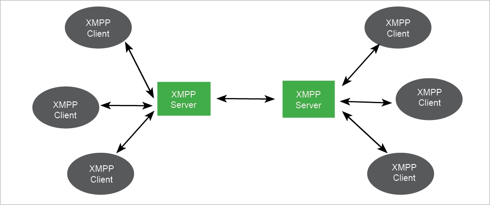
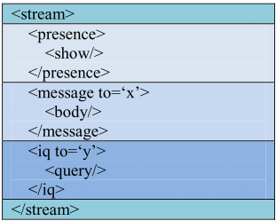

# XMPP (Extensible Messaging and Presence Protocol)

Открытый, основанный на XML, свободный для использования протокол для мгновенного обмена сообщениями и информацией о присутствии в режиме, близком к режиму реального времени. Очень распространен среди различных мессенджеров и прочих средств общения в сети. Протокол имеет место в IoT-системах, особенно при поддержке XMPP-сервером MQTT-клиентов.

[Демо](xmpp/demo/README.md)

## Основные аспекты протокола

### Модель системы XMPP представлена на рисунке ниже:

[источник изображения](https://www.briskbraintech.com/xmpp-a-communication-protocol-for-the-internet-of-things/)

Протокол работает по классической модели client/server, для идентификации клиентов используются уникальные записи JID (Jabber ID), по своей структуре очень напоминающие адрес электронной почты.

Обмен осущетсвляется за счет двух основных частей: XML-потоки, XML-элементы (внутри потока перемещаются элементы). Пример структуры передаваемых XML-сообщений представлен ниже (присутствие в сети, данные, запрос).

[источник изображения](https://www.researchgate.net/publication/329609409_Security_Vulnerabilities_and_Cyber_Threat_Analysis_of_the_XMPP_Protocol_in_an_IoT_Ecosystem)

Более подробно изучить протокол можно по следующим ссылкам:
* [подробное описание протокола, а также применение в системе "Умный дом"](https://www.in.tum.de/fileadmin/w00bws/cm/thesis/bt-sauter-2020.pdf);
* [оффициальный сайт](https://xmpp.org);
* [реализация XMPP-IOT](https://xmpp.org/uses/internet-of-things.html);
* [спецификации XMPP](https://xmpp.org/extensions/).

## Наиболее значимые характеристики протокола

|   Характеристика  |   Значение    |
|----               |----
|   Адаптация к IoT (балл)    |   2/4 |
|   Транспортный Уровень    |   TCP |
|   Кодирование    |    Текстовый    |
|   Заголовок    |    -    |
|   Архитектура    |    Client/Server    |
|   Модель взаимодействия    |    Req/Res   |
|   Участок в сети (наибольшая эффективность)    |    Client2Server,    |
|   Надежность    |    TCP    |
|   Безопасность    |    TLS-шифрование, аутентификация SASL    |

**Процесс разработки и запуск системы на базе XMPP** достаточно простые, если использовать готовый облачный сервер в связке с MQTT-клиентами. В случае самостоятельного развертывания и настройки сервера, а также реализации клиентов на базе XMPP, разработка будет достаточно непростой, поскольку протокол не совсем адаптирован под IoT-платформу.

Та часть **документации** по разработке, которая касается применения протокола в сфере IoT, оставляет желать лучшего. Можно найти реализации, которые не корректно функционируют, либо нигде нет информации о том, как с ними работать.

## Список реализаций XMPP:
* [список реализаций на оф. сайте](https://xmpp.org/software/);
* [список реализаций Awesome XMPP](https://github.com/bluszcz/awesome-xmpp);
* [API для ESP32](https://github.com/COM8/esp32-xmpp-iot).

[:arrow_left: На главную](/README.md)
